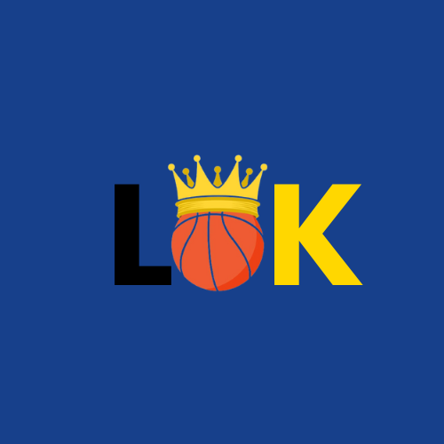
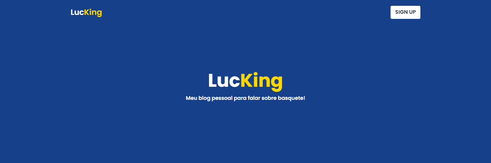
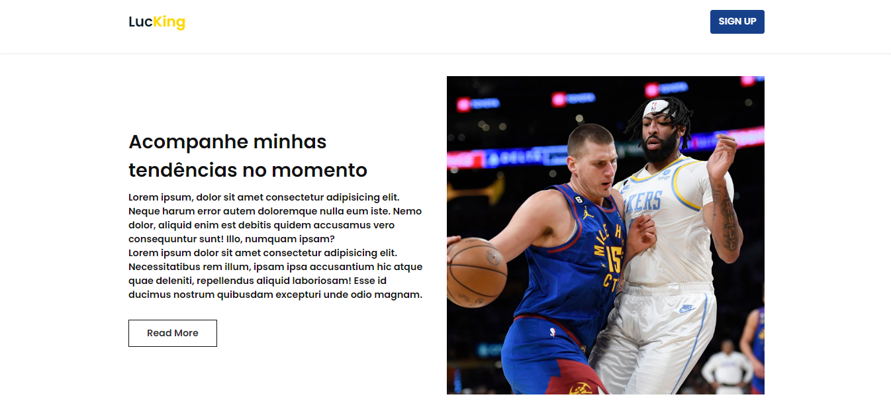
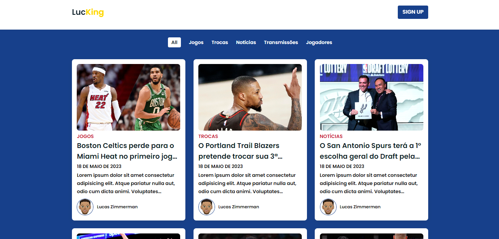
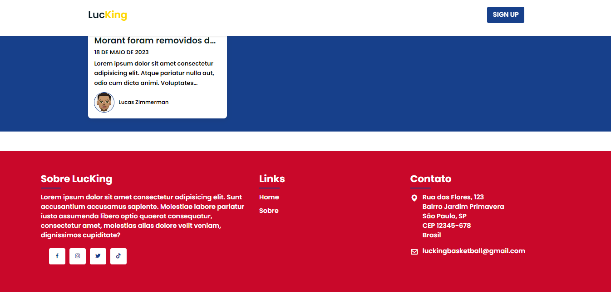

# LucKing - Blog sobre basquete

LucKing é um blog pessoal OnePage que aborda diversos aspectos relacionados ao basquete. O blog inclui postagens sobre jogos, trocas, notícias, transmissões e jogadores. O Blog também possui um rodapé com infomações adicionais como Contato e Sobre.

Ainda pretendo implementar o blog futuramente, criando páginas para cada postagem e uma barra de navegação para navegar entre as postagens.

## Tecnologias utilizadas

- HTML5
- CSS3
- JavaScript

## Pré-requisitos

Certifique-se de ter um navegador web moderno instalado para visualizar corretamente o blog.

## Como executar o projeto

1. Clone este repositório em sua máquina local.
2. Navegue até o diretório do projeto.
3. Abra o arquivo `index.html` em seu navegador web.
4. Agora você pode navegar pelo blog e ler as postagens.

## Estrutura do projeto

O projeto é estruturado da seguinte forma:

- O arquivo `index.html` é a página principal do blog.
- O arquivo `style.css` contém a estilização do blog.
- O arquivo `main.js` contém o código JavaScript responsável pela interatividade do blog.
- A pasta `assets` contém as imagens utilizadas nas postagens.

## Contato

- Autor: Lucas Zimmerman
- Email: lucaszimmermants@gmail.com

Sinta-se à vontade para entrar em contato caso tenha alguma dúvida ou sugestão.

# Demonstração

Header

About

Posts

Rodapé

